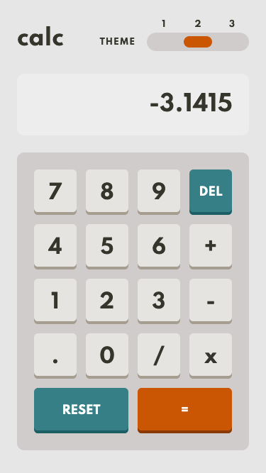
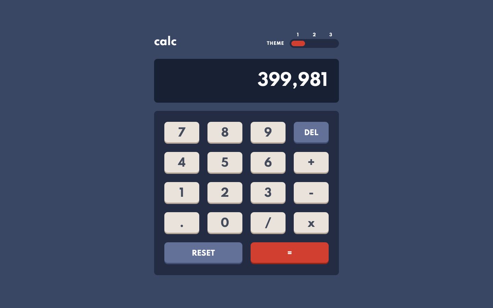

# Frontend Mentor - Calculator App Solution

This is a solution to the [Calculator App challenge on Frontend Mentor](https://www.frontendmentor.io/challenges/calculator-app-9lteq5N29). Frontend Mentor challenges help you improve your coding skills by building realistic projects. 

## The challenge

Users should be able to:

- See the size of the elements adjust based on their device's screen size
- Perform mathmatical operations like addition, subtraction, multiplication, and division
- Adjust the color theme based on their preference
- **Bonus**: Have their initial theme preference checked using `prefers-color-scheme` and have any additional changes saved in the browser

## Screenshot

### Mobile


### Desktop


## Built with

- Semantic HTML5 markup
- CSS custom properties
- CSS Grid
- SASS
- JS
- jQuery

## What I learned

I probably learned more from this Frontend Mentor project than any other so far and it is also the first challenge that I have completed at intermediate difficulty. Here are just a few of the things I learned or ideas I came up with:

### 1. Screen-reader functionality
Giving HTML elements an `aria-label` can be extremely helpful for screen-reader users. For example, the page color themes have labels '1', '2' and '3', however without an `aria-label` on each `<input>` element, the user will not know what these numbers are for if they can't see the colors change when toggling the theme. `aria-label="Dark color theme"` is a lot more informative and explains what is happening when the user selects that radio button.

Another use of `aria-label` is on the `<button>` elements such as '-' and '.'. The screen-reader will announce these as 'hyphen' and 'period' which is not what we want in this mathematical context. `aria-label="minus"` and `aria-label="decimal"` will tell the screen-reader to read out these values instead of the default ones.

`aria-live="polite"` is an attribute that makes the screen-reader read out the contents of an element every time it is updated. I used this on the 'display' element so that the user is aware what number is presented on the screen everytime they press a new button.


### 2. Animating the color theme

Multiple transitions can be declared under the same property by separating each one with a comma:
```css
.calc {
    & *,
    & *::after {
        transition:
            color var(--anim),
            background var(--anim),
            border var(--anim);
    }
```
This creates a very smooth transition as all properties are animated together.

### 3. prefers-color-scheme
There is a `prefers-color-scheme` media-query which I was unfortunately not able to take advantage of because of the way I had set up my color theme switching. I did however find a solution in JavaScript which does the same thing; if the user has a particular theme preference (light or dark) which they can set in their browser, this will be respected because of this code: 

```js
window.matchMedia("(prefers-color-scheme: light)").addEventListener('change', function(e) {
    if (e.matches) {
        $("#light").prop("checked", true).change();
    }
})

window.matchMedia("(prefers-color-scheme: dark)").addEventListener('change', function(e) {
    if (e.matches) {
        $("#dark").prop("checked", true).change();
    }
})
```

### 4. RegExp List
When the JavaScript started to become more and more complicated, I decided to create a list of all the regular expressions I was using so that I could assign semantically-helpful names to each of them. Here is the list I ended up with:

```js
// RegExps
const isOneDigit = new RegExp(/^\-?\d$/);
const isDigitOrDecimalOrMinus = new RegExp(/[\d\.\-]/);
const isOperation = new RegExp(/[\+\-x\/]/);
const redundantZeros = new RegExp(/\.?0+$/);
const locationsForCommas = new RegExp(/\B(?=(\d{3})+(?!\d))/, 'g');
const commas = new RegExp(/,/, 'g');
const isInfinityOrNaN = new RegExp(/Infinity$|NaN/);
const hasExpThenNumberOne = new RegExp(/e\+1$/);
const hasExpThenOneDigit = new RegExp(/e\+\d$/);
const hasExpThenMultipleDigits = new RegExp(/e\+\d+$/);
```

### 5. Number.prototype.toExponential()
I learned how to create exponential numbers in JavaScript. I wasn't going to worry about this at first but I ran into a problem of there being too many numbers on the screen until it was horizontally stretching the whole page. The exponential number notation actually shortens the number as you get to control how many digits long it is:

```js
if (Math.abs(number) > 999999999) {
    return Number.parseFloat(number).toExponential(6);
}
```

## Continued development

I need to continue taking on more difficult challenges like this. Recently I think I have been picking projects that I know I can complete quite easily, however I am going to pick at least intermediate difficulty level from now on so that my coding ability improves faster!